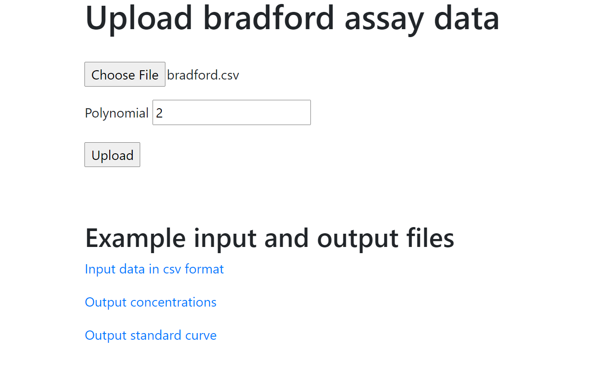
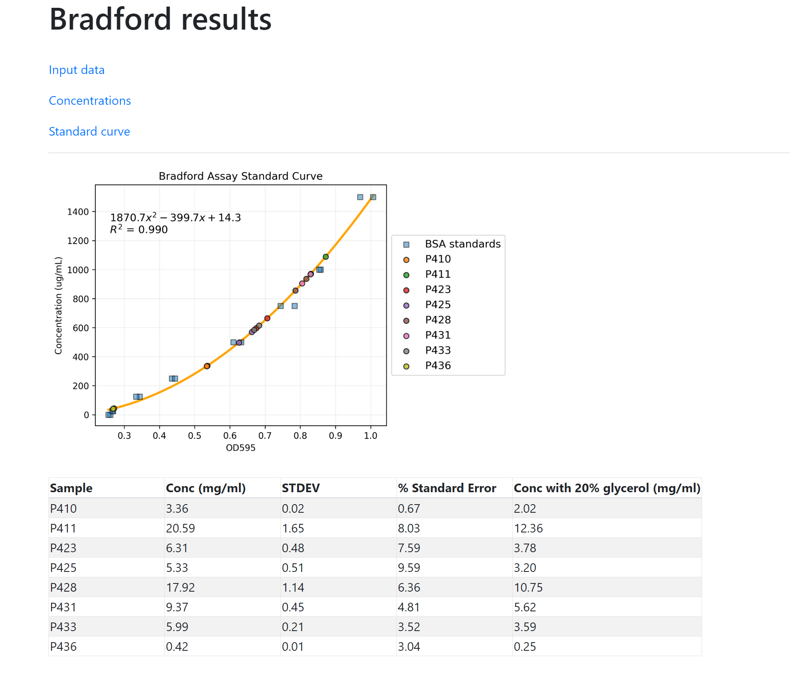

# Bradford Flask

Calculate and plot protein concentrations from Bradford absorbance assays.

## Instructions

### Example

```
git clone https://github.com/eking2/bradford_flask.git
cd bradford_flask
pipenv shell
pipenv install
python app.py
```

Go to the webpage `http://127.0.0.1:5000/` and upload the raw absorbance data from the spectrophotomer as a csv file. 
An example file with the required format is provided in `static/bradford.csv` or can be downloaded by clicking the link at the bottom of the home page.
The default polynomial to generate the standard curve is 2, change to 1 for a linear fit.

<br>


## Results

Submission will send you the the results page shown below.

<br>


The standard curve plot and calculated concentrations can be downloaded from the links at the top of the page. 
The determined concentration with 20% glycerol assumes dilution with 50% glycerol stock.
